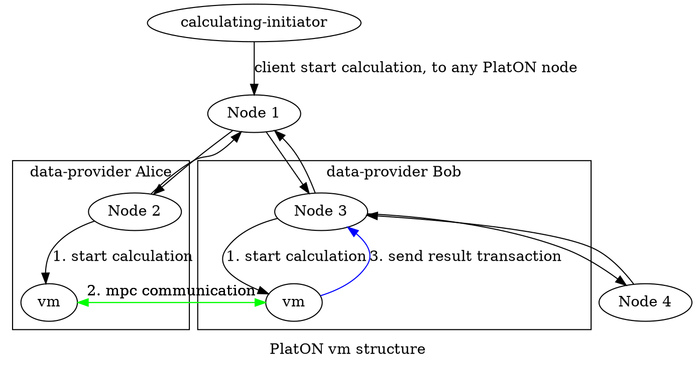
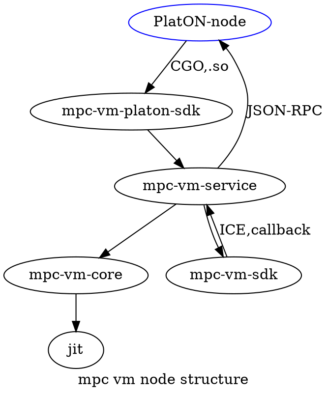

# SDK使用手册

- [SDK使用手册](#sdk%E4%BD%BF%E7%94%A8%E6%89%8B%E5%86%8C)
  - [写在前面](#%E5%86%99%E5%9C%A8%E5%89%8D%E9%9D%A2)
  - [概述](#%E6%A6%82%E8%BF%B0)
  - [基本概念](#%E5%9F%BA%E6%9C%AC%E6%A6%82%E5%BF%B5)
  - [基本流程](#%E5%9F%BA%E6%9C%AC%E6%B5%81%E7%A8%8B)
  - [快速开始](#%E5%BF%AB%E9%80%9F%E5%BC%80%E5%A7%8B)
      - [步骤0 环境准备](#%E6%AD%A5%E9%AA%A40-%E7%8E%AF%E5%A2%83%E5%87%86%E5%A4%87)
      - [步骤1 编写算法](#%E6%AD%A5%E9%AA%A41-%E7%BC%96%E5%86%99%E7%AE%97%E6%B3%95)
      - [步骤2 编译算法](#%E6%AD%A5%E9%AA%A42-%E7%BC%96%E8%AF%91%E7%AE%97%E6%B3%95)
      - [步骤3 发布合约](#%E6%AD%A5%E9%AA%A43-%E5%8F%91%E5%B8%83%E5%90%88%E7%BA%A6)
      - [步骤4 数据输入](#%E6%AD%A5%E9%AA%A44-%E6%95%B0%E6%8D%AE%E8%BE%93%E5%85%A5)
      - [步骤5 启动服务](#%E6%AD%A5%E9%AA%A45-%E5%90%AF%E5%8A%A8%E6%9C%8D%E5%8A%A1)
      - [步骤6 发起计算](#%E6%AD%A5%E9%AA%A46-%E5%8F%91%E8%B5%B7%E8%AE%A1%E7%AE%97)
      - [步骤7 查询结果](#%E6%AD%A5%E9%AA%A47-%E6%9F%A5%E8%AF%A2%E7%BB%93%E6%9E%9C)
  - [算法简介](#%E7%AE%97%E6%B3%95%E7%AE%80%E4%BB%8B)
      - [编写](#%E7%BC%96%E5%86%99)
          - [样例](#%E6%A0%B7%E4%BE%8B)
      - [编译](#%E7%BC%96%E8%AF%91)
          - [样例](#%E6%A0%B7%E4%BE%8B-1)
      - [测试](#%E6%B5%8B%E8%AF%95)
  - [数据提供方](#%E6%95%B0%E6%8D%AE%E6%8F%90%E4%BE%9B%E6%96%B9)
      - [启动参数](#%E5%90%AF%E5%8A%A8%E5%8F%82%E6%95%B0)
      - [启动流程](#%E5%90%AF%E5%8A%A8%E6%B5%81%E7%A8%8B)
      - [编程指南](#%E7%BC%96%E7%A8%8B%E6%8C%87%E5%8D%97)
          - [示例1](#%E7%A4%BA%E4%BE%8B1)
          - [示例2](#%E7%A4%BA%E4%BE%8B2)
  - [计算发起方](#%E8%AE%A1%E7%AE%97%E5%8F%91%E8%B5%B7%E6%96%B9)
      - [编程指南](#%E7%BC%96%E7%A8%8B%E6%8C%87%E5%8D%97-1)
      - [编程API](#%E7%BC%96%E7%A8%8Bapi)
      - [样例工具](#%E6%A0%B7%E4%BE%8B%E5%B7%A5%E5%85%B7)
          - [示例](#%E7%A4%BA%E4%BE%8B)
  - [附注](#%E9%99%84%E6%B3%A8)

## 写在前面

***内容有点多，请按顺序耐心阅读，有些概念或使用方法(尤其是快速开始部分)会在前文提到，但不会再次在后文出现。***

***`附注`也很重要!!!***

***由于plang编译器在不断的优化升级中，不同版本生成的IR内容可能会不一样***

## 概述

这里主要是SDK的使用手册，包括MPC算法的编写、编译，数据提供方与计算发起方的编程。附带一个测试人员使用的工具，以及一些周边工具的说明或使用。


## 基本概念


***PlatonON 节点***

PlatON公链的某个节点。

***MPC VM虚拟机***

MPC算法执行器，主要提供计算任务的执行环境，以组件(.so)的方式接入PlatON节点。

***数据提供方***


***计算发起方***


***MPC***

> 
> 隐私合约使用C++语言开发，plang进行编译，运行在PlatON节点上。 
> 
> 隐私合约提供MPC运算基础类型，并提供这些类型的安全运算，用户可以使用这些数据类型，自由组合实现自己的算法。 
> 
> 隐私合约使用MPC安全计算协议传输数据、计算结果，参与方计算方在不泄露实际数据前提下，实现安全计算。当前版本为两方计算MPC合约编写规范，三方及多方MPC计算版本不久将推出。
> 
> 。。。 。。。


***SDK***

SDK，Java版本，开发工具IntelliJ IDEA，构建工具MAVEN，JDK版本1.8或以上。

SDK，包括两部分，[数据提供方](#%E6%95%B0%E6%8D%AE%E6%8F%90%E4%BE%9B%E6%96%B9)和[计算发起方](#%E8%AE%A1%E7%AE%97%E5%8F%91%E8%B5%B7%E6%96%B9)。


[这里](../../README.md)是整个工程的说明。

***请自行安装或配置相关环境。***

***plang***

编译MPC算法所使用的编译器，基于clang。


## 基本流程

if you can not see a graph, [click here](images/platon-vm-structure.png).


if you can not see a graph, [click here](images/mpc-vm-node-structure.png).


## 快速开始

**请务必仔细阅读这一部分的内容。**

### 步骤0 环境准备

- mpc-vm相关动态库(这些库在部署节点的时候需要)：

private-contract-vm生成
```
libmpc_vm_core.so
libmpc_vm_platonsdk.so
libmpc_vm_service.so

libprotobuf-lite.so
libprotobuf.so
```

llvm-jit生成
```
libmpc-jit.so.6
```

第三方依赖(这些依赖在编译private-contract-vm工程时有说明)
```
libGlacier2++11.so.36
libIce++11.so.36
libIceUtil++11.so.36

libjsonrpccpp-client.so.1
libjsonrpccpp-common.so.1
libjsonrpccpp-server.so.1

libhiredis.so.0.14
libmicrohttpd.so.12
```

- plang编译器

private-contract-compiler生成
```
plang
```

- 节点

要有两个或以上的PlatON节点，其中两个分别是数据提供方Alice与Bob。计算发起方可以是Alice或Bob或任意的第三方。可以在同一机器上部署，也可以有不同的机器上部署，前者以端口区分即可，后者端口可以相同。

- java相关

jdk1.8或以上。

maven 3.3.9或以上。

- 带宽

带宽是资源，由于mpc计算会涉及到大量的网络IO，对带宽要求比较高。

- 其他


### 步骤1 编写算法

现在我们以`姚氏百万富翁问题`的例子来说明。

> 两个百万富翁想比较一下谁更富有，但是，1，都不想暴露自己的具体金额；2，都不想让第三方知道。

假设两个百万富翁分别是Alice和Bob。

函数声明可以是这样的，输入是Alice的金额与Bob的金额，如果Alice大于等于Bob，则返回true。
```cpp
bool YaoMillionairesProblem(int money1, int money2);
```

函数声明也可是这样的，输入是Alice的金额与Bob的金额，返回Alice与Bob金额的差额。注意，在这种情况下，1，可以知道两个富翁的金额之差；2，如果知道任何一方的金额，则可以推断出另一方的金额。
```cpp
int YaoMillionairesProblem(int money1, int money2);
```

在实现函数之前，需要先了解一下内部使用的[Integer](include/platon_integer.h)对象，它提供基本的算术运算、绝对值、位运算等MPC安全计算。其实，就是一个C++类，重载了基本运算符。在进行计算之前，先构造一个Integer对象，然后再参考运算。

就例子而言，比较两个富翁金额的大小，可以这么写：
```cpp
platon::mpc::Integer alice_money(money1, ALICE); // 构造Alice Integer对象
platon::mpc::Integer bob_money(money2, BOB); // 构造Bob Integer对象

platon::mpc::Integer result = alice_money - bob_money; // 两者相减
```

但是，上面得到的结果是Integer类型，此时还需要调用reveal_int()：
```cpp
int ret = result.reveal_int(); // 得到结果
```

根据前面两种函数声明的返回值类型，返回结果
```cpp
return ret; // Return ret, Alice - Bob
```
或者
```cpp
return ret >=0; // Return true, if Alice >= Bob
```


完整[函数实现](quickstart/YaoMillionairesProblem.cpp)如下：
```cpp
#include <iostream>

#include "platon_integer.h"

/*
Yao's millionaires' problem, show who is richer.
Return true, if Alice >= Bob.
*/
bool YaoMillionairesProblem(int money1, int money2) {
    std::cout << __FUNCTION__ << " Alice: " << money1 << " Bob: " << money2 << std::endl;

    platon::mpc::Integer alice_money(money1, ALICE);
    platon::mpc::Integer bob_money(money2, BOB);

    int ret = (alice_money - bob_money).reveal_int();
    std::cout << __FUNCTION__ << " result(=Alice-Bob): " << ret << std::endl;

    return ret >= 0;
}
```

### 步骤2 编译算法

在编译之前，准备所需要的头文件在`include/`，配置文件、源码文件在`quickstart/`，其中[YaoMillionairesProblem.cpp](quickstart/YaoMillionairesProblem.cpp)是我们编写的MPC算法；[config.json](quickstart/config.json)是配置文件，里面提供了两个参与方的基本信息，包括钱包地址，通信URL，调用费用，分润规则等。

config.json样例如下，请根据具体情况修改：
```json
{
  "invitor": "0x60ceca9c1290ee56b98d4e160ef0453f7c40d219",
  "parties": [
    "0x60ceca9c1290ee56b98d4e160ef0453f7c40d219",
    "0x3771c08952f96e70af27324de11bb380ec388ec3"
  ],
  "method-price": {
    "foo_abs": 200
  },
  "profit-rules": {
    "0x60ceca9c1290ee56b98d4e160ef0453f7c40d219": 1,
    "0x3771c08952f96e70af27324de11bb380ec388ec3": 2
  },
  "urls": {
    "0x60ceca9c1290ee56b98d4e160ef0453f7c40d219": "DirectNodeServer:default -h 10.10.8.155 -p 10001",
    "0x3771c08952f96e70af27324de11bb380ec388ec3": "DirectNodeServer:default -h 10.10.8.155 -p 10002"
  }
}
```

其中：
```
invitor 指定邀请方，是parties之一。
parties 指定参与方，目前只能有两方。
urls    指定对应方的通信URL。其中，DirectNodeServer固定，只需要修改ip与port即可。
```

接下来，使用plang编译器进行编译。
```bash
./plang YaoMillionairesProblem.cpp -config config.json -I../include
```

终端输出如下：
```
digest:
 * IR NAME: MPCYaoMillionairesProblem
 * IR HASH: 410bcb121d3904ad63dd6b94c6424f27
 * <p>
 * IR FUNC HASH(MD5)                 IR FUNC NAME
 * 0588f14217b11e0f77e50d03a88ba866  YaoMillionairesProblem
```

文件输出如下(存放在`quickstart-gencode/`):
```
.
├── code
│   └── java
│       ├── MPCYaoMillionairesProblem.java              # 给数据提供方使用
│       ├── MPCYaoMillionairesProblem-README.TXT
│       ├── ProxyYaoMillionairesProblem.java            # 给计算发起方使用
│       └── ProxyYaoMillionairesProblem-README.TXT
├── mpcc.cpp                                            # 给发布合约使用
└── YaoMillionairesProblem.cpp.bc                       # 生成的ir二进制
```

注意：
如果你实质性地修改了算法，生成的`IR HASH`是不会相同的，对应生成的java代码的接口类名称也会相应改变。（这里的实质性修改是指导致算法的二进制内容不同。）


### 步骤3 发布合约

用上一步生成的mpcc.cpp文件，编译生成.wasm文件，使用cli工具进行合约发布。

具体参考[合约发布与调用](#)，[合约编写](#)。

假设发布合约后生成的合约地址是：
```
0x43355c787c50b647c425f594b441d4bd75198888
```

### 步骤4 数据输入

此步需要编程，目前只提供java版本的SDK，所以需要一定的java编程基础。

1. maven工程，在pom.xml中加入`mpc-data-sdk`。
```xml
    <dependency>
        <groupId>net.platon.mpc</groupId>
        <artifactId>mpc-data-sdk</artifactId>
        <version>1.0-SNAPSHOT</version>
    </dependency>
```

2. 编写代码。将第2步生成的供数据提供方使用的java代码放入工程，并实现inputImpl方法(在[MPCYaoMillionairesProblem.java](#)中)。`不要修改包名!!!`。
```java

    /**
     * YaoMillionairesProblem(int,int)
     */
    final class MPCYaoMillionairesProblem_YaoMillionairesProblem_int_int_01 extends mpc_f_0588f14217b11e0f77e50d03a88ba866_01 {
        public byte[] inputImpl(final InputRequestPara para) {
            int ret_value = 0;
            // TODO: assemble data

            ret_value = 1000000; // Alice 1 million
            
            return Data.Int32(ret_value);
        }
    }

    /**
     * YaoMillionairesProblem(int,int)
     */
    final class MPCYaoMillionairesProblem_YaoMillionairesProblem_int_int_02 extends mpc_f_0588f14217b11e0f77e50d03a88ba866_02 {
        public byte[] inputImpl(final InputRequestPara para) {
            int ret_value = 0;
            // TODO: assemble data

            ret_value = 2000000; // Bob 2 million

            return Data.Int32(ret_value);
        }
    }
```

Alice方只需要实现`MPCYaoMillionairesProblem_YaoMillionairesProblem_int_int_01`中的方法即可。

Bob方只需要实现`MPCYaoMillionairesProblem_YaoMillionairesProblem_int_int_02`中的方法即可。

```
关于类名的说明，对于`MPCYaoMillionairesProblem_YaoMillionairesProblem_int_int_01`：
    MPCYaoMillionairesProblem MPC+文件名。
    YaoMillionairesProblem 方法名。
    int_int 两个输入参数的类型。
    01 输入角色。
    这里只是文件名与方法名恰好一样并且都还不短，所以不要纠结类名重复或太长...
```

```
关于方法类名的说明，对于`mpc_f_0588f14217b11e0f77e50d03a88ba866_01`：
    mpc_f 前缀。
    0588f14217b11e0f77e50d03a88ba866 方法YaoMillionairesProblem的MD5值。
    01 输入角色。
    这里使用MD5是为了以后使用函数重载考虑的。
```
完整项目，Alice方参考[samples/mpc-data-sdk-client1](../../samples/mpc-data-sdk-client1/src/main/java/net/platon/vm/mpc/MPCYaoMillionairesProblem.java)，Bob方参考[samples/mpc-data-sdk-client2](../../samples/mpc-data-sdk-client2/src/main/java/net/platon/vm/mpc/MPCYaoMillionairesProblem.java)。

### 步骤5 启动服务

***说明：一般地，数据提供方也是公链节点的一部分，数据提供方客户端连接的也是本地节点。***

1. 启动PlatON节点。

***配置：***

- 在与`platon`同级目录下，需要有`config/mpcc.cpp.abi.json`文件，这是默认路径。

***运行：***

```bash
> ./platon arg1 arg2 arg3 ...
```

运行 ./platon --help 可以获取帮助信息。
其中 --mpc.ice 是ice服务端的配置文件路径，若不设置或文件路径不正确，则使用默认值(`tasksession:default -h 0.0.0.0 8201`)。

2. 启动数据服务。

***配置：***

| 参数       | 说明        | 可空 |
| ---------- | ----------- | ---- |
| walletPath | 钱包路径    | 否   |
| walletPass | 钱包密码    | 否   |
| iceCfgFile | ICE配置文件 | 否   |


***运行：***

启动上一步编写的客户端即可。

Alice方：
```bash
> cd /path/to/samples
> java -jar mpc-data-sdk-client1/target/mpc-data-sdk-client1-1.0-SNAPSHOT.jar --walletPath=./config/60ceca9c1290ee56b98d4e160ef0453f7c40d219 --walletPass=11111111 --iceCfgFile=./config/cfg.client1.linux.config
```

Bob方：
```bash
> cd /path/to/samples
> java -jar mpc-data-sdk-client2/target/mpc-data-sdk-client2-1.0-SNAPSHOT.jar --walletPath=./config/3771c08952f96e70af27324de11bb380ec388ec3 --walletPass=11111111 --iceCfgFile=./config/cfg.client2.linux.config
```

相关日志会输出到logs/。

***注意：1和2两个启动没有先后顺序。但是，如果数据方还没有启动，就已经有计算任务了，会直接被丢弃。***


### 步骤6 发起计算

这一步可以由任意可以发起交易的节点进行。

至少需要钱包路径，钱包密码，合约地址(发布合约后)，要调用的方法(参考上面编写的算法)。

此步需要编程，目前只提供java版本的SDK，所以需要一定的java编程基础。

注意：

这个示例工程建议在IDE中运行，这样更方便调试。

1. maven工程，在pom.xml中加入`mpc-proxy-sdk`。
```xml
    <dependency>
        <groupId>net.platon.mpc</groupId>
        <artifactId>mpc-proxy-sdk</artifactId>
        <version>1.0-SNAPSHOT</version>
    </dependency>
```

2. 编写代码。将第2步生成的计算发起方使用的java代码放入工程。
```java
public static void main(String[] args) {
    /*
    * 0. you should provide follow arguments
    */
    String walletPath = System.getProperty("user.dir") + "/samples/config/60ceca9c1290ee56b98d4e160ef0453f7c40d219";
    String walletPass = "11111111";
    String url = "http://1.1.1.1:11111";
    String contractAddress = "0x43355c787c50b647c425f594b441d4bd75198888";

    /*
    * 1. new a proxy client, and set contract address, there are 4 different Constructors
    */
    ProxyYaoMillionairesProblem client = new ProxyYaoMillionairesProblem(url, walletPath, walletPass);
    client.setContractAddress(contractAddress);

    /*
    * 2. start calc, by pass a method
    */
    String transactionHash = client.startCalc(ProxyYaoMillionairesProblem.Method.boolean_YaoMillionairesProblem_int_int, 3);

    /*
    * 3. get result
    */
    {
        // by transaction hash returned by StartCalc, default timeout is 80s
        String cipher = client.getResultByTransactionHash(transactionHash, 180);
        if (cipher != null) {
            boolean b = client.getBool(cipher);
            logger.info("Client1 result : {} richer", b ? "alice" : "bob");
        } else {
            logger.info("try later!");
        }
    }
}
```

更多细节与描述参考完整工程[mpc-proxy-sdk-quickstart](../../samples/mpc-proxy-sdk-quickstart/src/main/java/client/Client.java)。

***说明，多个ProxyXXXXX.java是可以在同一个工程下一起进行编程的，文件名及类名冲突请自行解决。***

对于quickstart，到这一步就结束了。

### 步骤7 查询结果

之所以写这一步，是因为上一步骤(3. get result)是可以独立出来的，具体描述参考下文。

这一步可以由任意可以发起查询的节点进行，但是只有计算发起方才能拿到结果的明文，其他节点只能拿到密文。


## 算法简介

此处只是简单说明一下MPC算法的[编写](#%E7%BC%96%E5%86%99)、[编译](#%E7%BC%96%E8%AF%91)、[测试](#%E6%B5%8B%E8%AF%95)，具体内容[参考这里](#)。


### 编写

MPC算法基于C++、Google Protocol Buffer协议，故需要具备一定的相关知识。

分两步。

1. 编写proto文件。

如果只进行基本类型(函数与返回值)的操作 `(C++: bool int8_t int16_t int32_t int64_t float double std::string)` ，请忽略此步。参考`快速开始`部分的[步骤1 编写算法](#%E6%AD%A5%E9%AA%A41-%E7%BC%96%E5%86%99%E7%AE%97%E6%B3%95)。

否则，复杂的结构体需要编写相关message的定义。关于如何编写protocol buffer 3文件，请查阅相关文档。

**特别说明**

- 请注意protobuf的版本，为[v3.6.1](https://github.com/protocolbuffers/protobuf/tree/v3.6.1)。

- 在编写proto文件时，请指定protocol buffer版本如下：
```
syntax = "proto3";
```

- 推荐指定下面两项：
```
package yourpackage;
option java_package = "your.organization.groupid";
```

***注意：如果你的proto文件名为XXX.proto，而里面定义了一个XXX的message，在用protoc编译生成java文件时，文件名会命名为XXXOuterClass.java。请不要惊讶！***


2. 编写算法。

使用C++。

入门，请参考`快速开始`部分的[步骤1 编写算法](#%E6%AD%A5%E9%AA%A41-%E7%BC%96%E5%86%99%E7%AE%97%E6%B3%95)。

深入，请参考下面的样例。

#### 样例

一些样例如下([编译参考这里](#%E6%A0%B7%E4%BE%8B))：

- 一个简单样例。[Simple.cpp](samples/Simple.cpp)。
- 两个带有proto的简单样例。[SimpleProto1.cpp](samples/SimpleProto1.cpp),[SimpleProto1.proto](samples/SimpleProto1.proto);[SimpleProto2.cpp](samples/SimpleProto2.cpp),[SimpleProto2.proto](samples/SimpleProto2.proto)。
- 一个带有多个proto多个算法的样例。[Foo.cpp](samples/Foo.cpp),[Bar.cpp](samples/Bar.cpp),[Foo.proto](samples/Foo.proto),[Bar.proto](samples/Bar.proto)。
- 一个综合样例。[Samples.cpp](samples/Samples.cpp),[Samples.proto](samples/Samples.proto)。***注意：以下所有关于`数据提供方`与`计算发起方`的说明，都是基于这两个样例，阅读那两部分之前请首先大致浏览一下。***


### 编译

使用plang进行编译。

相关依赖头文件在`include`文件夹，编译时，请包含这个路径，使用`-I/path/to/include`。

***注意 1：plang是跨平台的，但由于不同平台生成的符号不一样，目前plang与jit的良好配合只能在linux平台正常工作。***

#### 样例

下面是关于[算法样例](#%E6%A0%B7%E4%BE%8B)的编译。
相关文件结构如下：
```
.
├─include
│      bit.h
│      block.h
│      comparable.h
│      io_channel.h
│      platon_core_conf.h
│      platon_integer.h
│      swappable.h
│
├─samples
│      Bar.cpp
│      Bar.proto
│      Foo.cpp
│      Foo.proto
│      Samples.cpp
│      Samples.proto
│      Simple.cpp
│      SimpleProto1.cpp
│      SimpleProto1.proto
│      SimpleProto2.cpp
│      SimpleProto2.proto
```

以下操作都在`samples`目录下。

- 一个简单样例

```bash
> ./plang -config config.json Simple.cpp -I../include
```

- 两个带有proto的简单样例

```bash
# 先编译proto生成.cc与.java。
> rm -rf code
> mkdir code
> protoc --java_out=./code SimpleProto1.proto
> protoc --cpp_out=./code SimpleProto1.proto

# 再编译生成mpcc.cpp
> ./plang -config config.json SimpleProto1.cpp -protobuf-cc code/SimpleProto1.pb.cc -protobuf-java code/com/abc/simpleproto1/SimpleProto1.java -I./code -I../include
```

***注意 2：如果编译过程中遇到找不到protobuf相关的头文件时，请自行包含进来，注意版本号为[3.6.1](https://github.com/protocolbuffers/protobuf/tree/v3.6.1/src)。编译时，使用`-I/path/to/protobuf/include/`，或者将protobuf加入到系统环境变量。***

*SimpleProto2与SimpleProto1的编译是一样的，这里不列出。*

- 一个带有多个proto多个算法的样例

```bash
# 先编译proto生成.cc与.java。
> rm -rf code
> mkdir code
> protoc --java_out=./code Foo.proto Bar.proto
> protoc --cpp_out=./code Foo.proto Bar.proto

# 再编译生成mpcc.cpp
> ./plang -config config.json Foo.cpp Bar.cpp -protobuf-cc code/Foo.pb.cc -protobuf-cc code/Bar.pb.cc -protobuf-java code/com/abc/multiproto/FooOuterClass.java -protobuf-java code/com/abc/multiproto/BarOuterClass.java -I./code -I../include -o multiproto.bc
```

***注意 3：一个-protobuf-cc对应一个.cc文件，一个-protobuf-java对应一个.java文件。***

- 一个综合样例

与SimpleProto1的编译是一样的。
```bash
# 先编译proto生成.cc与.java。
> rm -rf code
> mkdir code
> protoc --java_out=./code Samples.proto
> protoc --cpp_out=./code Samples.proto

# 再编译生成mpcc.cpp
> ./plang -config config.json Samples.cpp -protobuf-cc code/Samples.pb.cc -protobuf-java code/com/abc/sample/Samples.java -I./code -I../include
```

更多编译选项，请执行`--help`。
```
> ./plang --help
OVERVIEW: PlatON C++ compiler

USAGE: plang [clang args] [options] <inputs>

OPTIONS:
  -config <file>        Set config file path
  --help                Display available options
  -java-code <directoy> Write java code to directoy
  -mpcc <file>          Write mpcc to <file>
  -o <file>             Write output to <file>
  -protobuf-cc <file>   Set protobuf *.cc file path
  -protobuf-java <file> Set protobuf *.java file path
  -S                    Write output as LLVM assembly
```


### 测试

**(内部使用)**

具体参考下面的数据提供方和计算发起方相关内容。

下面是一些测试用例。

- 基本类型。[TestBasicType.cpp](test/TestBasicType.cpp)
- 结构类型。[TestProto.cpp](test/TestProto.cpp), [TestProto.proto](test/TestProto.proto)
- 性能测试。[TestPerf.cpp](test/TestPerf.cpp)


## 数据提供方

初步使用，参考[步骤4 数据输入](#%E6%AD%A5%E9%AA%A44-%E6%95%B0%E6%8D%AE%E8%BE%93%E5%85%A5)。

### 启动参数

| 参数       | 说明        | 可空 |
| ---------- | ----------- | ---- |
| walletPath | 钱包路径    | 否   |
| walletPass | 钱包密码    | 否   |
| iceCfgFile | ICE配置文件 | 否   |

说明：服务端ice默认参数`tasksession:default -h 0.0.0.0 8201`。

启动示例：

```bash
java -jar client.jar --walletPath=/path/to/wallet --walletPass=password --iceCfgFile=./config/cfg.client.config
```

### 启动流程

- 获取钱包地址。
- 连接服务端。
- 设置回调监听。
- 注册到服务端。
- 开启ping线程。


程序运行的过程中出现任何连接异常，都会进行重新连接。


### 编程指南

***说明1：因为不同的MPC算法的`函数方法`、`函数参数类型`是不尽相同的，在[编译MPC算法](#%E7%BC%96%E8%AF%91)时会生成不同的代理类。***


接口：
```java
public class InputRequestPara {
    public String customer = ""; // tx address
    public String task_id = ""; // task id
    public String ir_hash = "";// ir hash
    public String method = ""; // method
    public String[] peers = null; // participants
}
public interface MpcCallbackInterface {
    public byte[] input(final InputRequestPara para); // data input
    public void error(final InputRequestPara para, ErrorCode error); // error notify
    public void result(final InputRequestPara para, final byte[] data); // result notify
}
```

`MpcCallbackInterface 数据输入，错误通知，结果通知。`

数据提供方务必实现代理类中的`InputImpl`方法，否则计算时拿到的数据都是相关类型的默认值。
 
在实现`InputImpl`时，您可以去数据库或文件或云上等等取数据，然后，直接通过`ret_value`给基础类型赋值，或者通过`builder.set_XXX`给message结构体进行赋值。

`InputRequestPara 服务端请求时传入的参数。`

在实现InputImpl方法之前，可以在 `MpcCallbackBase_xxxxxxx`做一些通用处理，如保存相关数据。`SDK不做任何存储相关的处理。`


Bob方得到计算结果的明文后，会回调`result`方法。
如果出现错误，会回调`error`方法。


#### 示例1
```java
    /**
     * YaoMillionairesProblem(int,int)
     */
    final class MPCSamples_YaoMillionairesProblem_int_int_01 extends mpc_f_0588f14217b11e0f77e50d03a88ba866_01 {
        public byte[] inputImpl(final InputRequestPara para) {
            int ret_value = 0;
            // TODO: assemble data

            ret_value = 1000000; // Alice has 1 million

            return Data.Int32(ret_value);
        }
    }

    /**
     * YaoMillionairesProblem(int,int)
     */
    final class MPCSamples_YaoMillionairesProblem_int_int_02 extends mpc_f_0588f14217b11e0f77e50d03a88ba866_02 {
        public byte[] inputImpl(final InputRequestPara para) {
            int ret_value = 0;
            // TODO: assemble data

            ret_value = 2000000; // Bob has 2 million

            return Data.Int32(ret_value);
        }
    }
```

#### 示例2
```java
    /**
     * EuclideanDistance(Point,Point)
     */
    final class MPCSamples_EuclideanDistance_Point_Point_01 extends mpc_f_5ab2b5492eebb9fffe14c94278372bff_01 {
        public byte[] inputImpl(final InputRequestPara para) {
            com.abc.sample.Samples.Point.Builder builder = com.abc.sample.Samples.Point.newBuilder();
            // TODO: assemble data

            builder.setX(10).setY(20); // Alice's position is (10,20)

            return builder.build().toByteArray();
        }
    }

    /**
     * EuclideanDistance(Point,Point)
     */
    final class MPCSamples_EuclideanDistance_Point_Point_02 extends mpc_f_5ab2b5492eebb9fffe14c94278372bff_02 {
        public byte[] inputImpl(final InputRequestPara para) {
            com.abc.sample.Samples.Point.Builder builder = com.abc.sample.Samples.Point.newBuilder();
            // TODO: assemble data

            builder.setX(5).setY(15); // Bob's position is (5,15)

            return builder.build().toByteArray();
        }
    }
```
更多示例，参考[MPCSamples.java](../../samples/mpc-data-sdk-client/src/main/java/net/platon/vm/mpc/MPCSamples.java)。


## 计算发起方

初步使用，参考[步骤6 发起计算](#%E6%AD%A5%E9%AA%A46-%E5%8F%91%E8%B5%B7%E8%AE%A1%E7%AE%97)。

### 编程指南


有一些编程示例，源码文件中有详细的注释，请参考[Client1.java](../../samples/mpc-proxy-sdk-client/src/main/java/client/Client1.java),[Client2.java](../../samples/mpc-proxy-sdk-client/src/main/java/client/Client2.java),[Client3.java](../../samples/mpc-proxy-sdk-client/src/main/java/client/Client3.java)。

还有一个样例的命令行工具，参考下面章节。


### 编程API

1. 发起计算
```java
public String startCalc(Method method)
public String startCalc(Method method, int retry)
```
    method 要调用的方法，每一个算法中的方法都不相同。Method定义在生成的代理类中。
    返回交易哈希。
    根据哈希，可以获取任务ID，获取交易回执，获取结果密文等。
    如果返回null，您可以选择重发或者放弃。默认retry为0。

2. 获取任务ID
```java
public String getTaskId(String transactionHash)
public String getTaskId(String transactionHash, long timeout)
```

    transactionHash startCalc返回的交易哈希。
    timeout 最小0，最大180s。
    返回任务ID。

3. 获取交易回执
```java
public TransactionReceipt getTransactionReceipt(String transactionHash)
```

    transactionHash startCalc返回的交易哈希。
    返回交易回执。

4. 获取结果密文
```java
public String getResultByTransactionHash(String transactionHash)
public String getResultByTransactionHash(String transactionHash, long timeout)
public String getResultByTaskId(String taskId)
public String getResultByTaskId(String taskId, long timeout)
```

    transactionHash startCalc返回的交易哈希。
    taskId getTaskId返回的任务ID。
    timeout 最小0，最大180s。
    返回的是结果公钥加密(ECIES)后的密文。

5. 获取结果明文
```java
public int getInt32(String cipher)
public long getInt64(String cipher)
// getUInt32 getUInt64 getBool getFloat getDouble getString ... 
public com.abc.sample.Samples.Foo getFoo(String cipher)
public com.abc.sample.Samples.Bar getBar(String cipher)
// ...
```

    cipher 密文字符串。
    返回结果明文并解析到基本类型或message结构体。

6. 其他
```java
public static void showMethodMap()
```

    显示函数方法名，函数原型，函数枚举。

```java
public String getPlainText(String cipher)
```

    传入密文，获取结果明文(16进制字符串)。这个在知道私钥和密文的情况下即可使用。


***说明1：如果是`非计算发起方`查询结果，除非有`计算发起方`的私钥，否则拿到的只是加密后的结果。***

***说明2：因为不同的MPC算法的`函数方法`、`函数返回类型`是不尽相同的，在[编译MPC算法](#%E7%BC%96%E8%AF%91)时会生成不同的代理类，其中基本类型的解密包含在SDK中。***


### 样例工具

***再次说明，这个工具是基于samples/Samples的。供开发测试人员使用。如果你的MPC算法不是Samples，请参考[编程指南](#%E7%BC%96%E7%A8%8B%E6%8C%87%E5%8D%97-1)自行编写相关代码。***

[源码在这里](../../samples/mpc-proxy-sdk-tool/src/main/java/client/Client.java)。

执行`java -jar xxxxxx-tool.jar --help`会显示帮助信息，使用时参考之即可。文档可能未及时更新，请以程序的输出为准，示例如下：
```
==== Method Map Beg ====
CompareAge    CompareAge(int,int)    boolean_CompareAge_int_int
YaoMillionairesProblem    YaoMillionairesProblem(int,int)    boolean_YaoMillionairesProblem_int_int
EuclideanDistance    EuclideanDistance(Foo,Foo)    int_EuclideanDistance_Point_Point
==== Method Map End ====

===================== Usage =====================
-h             --help: Show this help

-s           --sample: Is run mpc sample

-w       --walletPath: Wallet path
-p       --walletPass: Wallet password
-c              --url: The url connect to PlatON node

-a  --contractAddress: MPC contract address
-n        --threadNum: Thread number, default 1, for performance test
-i              --api: MPC client api
                       =startCalc(method)
                       =startCalc2(method)
                       =getTaskId(transactionHash)
                       =getResultByTaskId(taskId)
                       =getResultByTransactionHash(transactionHash)
                       =getPlainText(cipher)
-m           --method: MPC method
```

***补充说明***

选项walletPath/walletPass/api必须，这时可以做一些简单的查询类工作。
交易或者查询指定合约地址时，url/contractAddress/method必须。
不要混用任务ID与交易哈希。

--api
    
    此选项除了 getPlainText 外，其余都需要 contractAddress；startCalc/startCalc2只有在交易时才有效，其中startCalc立即返回，startCalc2会等待结果或超时(180s)返回。

--method

    获取结果时，请别忘记它。
    当与getResult*一起使用时，除非是计算发起方调用，否则只能拿到密文，并且Invalid MAC异常。


#### 示例


以下操作都在`工程private-contract-sdk/samples`目录下。结构如下。
```
private-contract-sdk/samples
├── config
│   └── 60ceca9c1290ee56b98d4e160ef0453f7c40d219
└── mpc-proxy-sdk-tool
    ├── dependency-reduced-pom.xml
    ├── logs
    ├── mpc-proxy-sdk-tool.iml
    ├── pom.xml
    ├── src
    └── target
```

使用前准备工程，
1. 编译
```bash
> cd mpc-proxy-sdk-tool
> mvn package
> cd ..
```
2. 钱包路径

假设钱包路径为`config/60ceca9c1290ee56b98d4e160ef0453f7c40d219`里，密码为`11111111`。

3. 节点json-rpc url

假设url为`http://1.1.1.1:11111`。

4. 合约地址

假设合约地址为`0x1546f7e1ab94c797d62c07e2108aa14557bd7575`。

5. 要调用的方法

假设为`TestAdd`。

6. 使用

> 为了方便，下面
> 1. 用 tool.jar 代替 mpc-proxy-sdk-tool/target/mpc-proxy-sdk-tool-1.0-SNAPSHOT.jar。
> 
> 2. 用 /path/to/wallet 代替 ./config/60ceca9c1290ee56b98d4e160ef0453f7c40d219。


- 知道密文，获取明文
```bash
java -jar tool.jar --walletPath=/path/to/wallet --walletPass=11111111 --api="getPlainText(04d07c28c90bbb24505f985d66b08aea71b23d75489f84a9c2a81d7d10b2981564beb65c11337698f3236bf8947078399d0377bdf7c8de619a827d56a97c98edde350efd6e172a82c08307a6b80a7c163b62e03f8aa7d37a4a2fb5521af4c242b590d70afe5314edf53fb92d500a526abad8d8a5b1)"
```

- 发起交易，立即返回
```bash
java -jar tool.jar --walletPath=/path/to/wallet --walletPass=11111111 --url=http://1.1.1.1:11111 --contractAddress=0x1546f7e1ab94c797d62c07e2108aa14557bd7575 --api="startCalc(TestAdd)"
```

- 发起交易，等待结果
```bash
参考上一条，使用startCalc2。
```

- 手动获取任务ID
```bash
java -jar tool.jar --walletPath=/path/to/wallet --walletPass=11111111 --url=http://1.1.1.1:11111 --contractAddress=0x1546f7e1ab94c797d62c07e2108aa14557bd7575 --api="getTaskId(0xb899e31b583270e6e05e76d21ef1b302b3a4040f0d45a1fdef0fb07256d9e7a1)"
```

- 手动获取结果，通过交易哈希
```bash
java -jar tool.jar --walletPath=/path/to/wallet --walletPass=11111111 --url=http://1.1.1.1:11111 --contractAddress=0x1546f7e1ab94c797d62c07e2108aa14557bd7575 --api="getResultByTransactionHash(0xb899e31b583270e6e05e76d21ef1b302b3a4040f0d45a1fdef0fb07256d9e7a1)" --method=TestAdd
```

- 手动获取结果，通过任务ID
```bash
java -jar tool.jar --walletPath=/path/to/wallet --walletPass=11111111 --url=http://1.1.1.1:11111 --contractAddress=0x1546f7e1ab94c797d62c07e2108aa14557bd7575 --api="getResultByTaskId(f0e72bd3fd194e10d62348ba886c8241ee8b4f1b748f688a5d0649a4e337028c)" --method=TestAdd
```

## 附注

一些暂时或无法归类、或者补充说明、或者解释说明、或者一些TODO-LIST放在这里。


1. 任意数据提供方可以随时启动或停止
2. SDK的启动顺序与vm的启动顺序无关
3. 只有Bob才会发签名交易，将结果上链
4. 在数据提供方(客户端)还没有连接到vm之前，发起的计算任务将直接丢弃


**在使用或测试时，定位问题时，在搜索日志文件时，有以下关键词需要注意一下：**

| keyword      | description                                               |
| ------------ | --------------------------------------------------------- |
| CGO INIT     | 节点初始化vm                                              |
| CGO CALC     | 节点调用vm，准备要开始计算了                              |
| init step    | mpc engine 初始化步骤                                     |
| process step | mpc 准备计算到计算完成的处理步骤                          |
| TASK BEG     | 任务准备好始计算了                                        |
| TASK END     | 任务计算完成，如果Bob方中的status为PROCESS_OK则说明成功了 |


在`TASK END`中，返回下列关于任务(TASK)的status，则说明在某一过程中失败了：

| status                   | description           | Alice/Bob |
| ------------------------ | --------------------- | --------- |
| PROCESS_INIT             | -                     | ALL       |
| PROCESS_FAILED           | -                     | ALL       |
| PROCESS_SET_CALLBACK     | 设置回调              | ALL       |
| PROCESS_GET_INPUT        | 获取输入数据          | ALL       |
| PROCESS_RUN_FUNCTION     | 调用MPC算法           | ALL       |
| PROCESS_NOTIFY_RESULT    | 结果通知给数据方(Bob) | Bob       |
| PROCESS_ENCRYPT          | ECIES加密             | Bob       |
| PROCESS_SIGN_TRANSACTION | 数据方(Bob)签名       | Bob       |
| PROCESS_SEND_TRANSACTION | 发送签名交易          | Bob       |
| PROCESS_OK               | 成功                  | ALL       |


``只有Alice方和Bob方的status都是PROCESS_OK才是成功的。``
